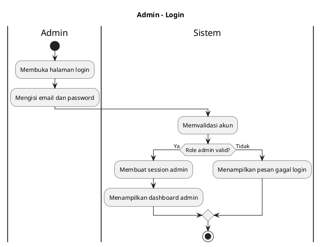
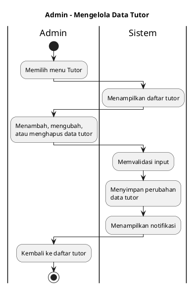
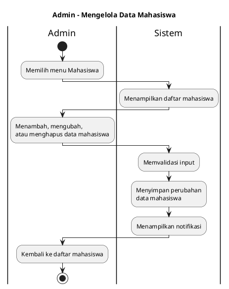
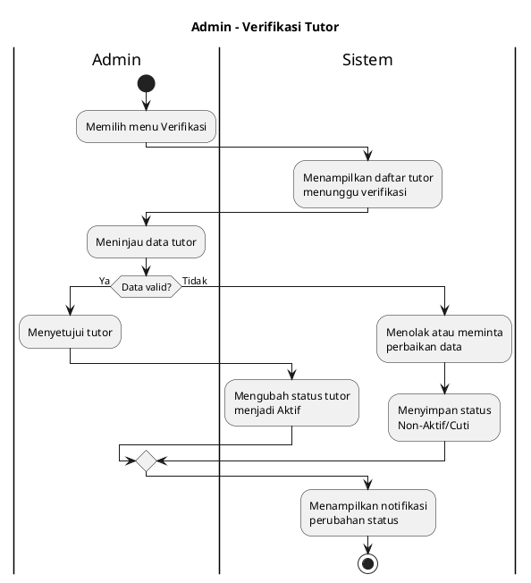

# Activity Diagram Admin

## Fitur Login Admin

```plantuml
@startuml
title Admin - Login

skinparam monochrome true
skinparam shadowing false
skinparam defaultFontName Arial

|Admin|
start
:Membuka halaman login;
:Mengisi email dan password;

|Sistem|
:Memvalidasi akun;
if (Role admin valid?) then (Ya)
  :Membuat session admin;
  :Menampilkan dashboard admin;
else (Tidak)
  :Menampilkan pesan gagal login;
endif

stop
@enduml
```

## Fitur Mengelola Data Tutor

```plantuml
@startuml
title Admin - Mengelola Data Tutor

skinparam monochrome true
skinparam shadowing false
skinparam defaultFontName Arial

|Admin|
start
:Memilih menu Tutor;

|Sistem|
:Menampilkan daftar tutor;

|Admin|
:Menambah, mengubah,\natau menghapus data tutor;

|Sistem|
:Memvalidasi input;
:Menyimpan perubahan\ndata tutor;
:Menampilkan notifikasi;

|Admin|
:Kembali ke daftar tutor;
stop
@enduml
```

## Fitur Mengelola Data Mahasiswa

```plantuml
@startuml
title Admin - Mengelola Data Mahasiswa

skinparam monochrome true
skinparam shadowing false
skinparam defaultFontName Arial

|Admin|
start
:Memilih menu Mahasiswa;

|Sistem|
:Menampilkan daftar mahasiswa;

|Admin|
:Menambah, mengubah,\natau menghapus data mahasiswa;

|Sistem|
:Memvalidasi input;
:Menyimpan perubahan\ndata mahasiswa;
:Menampilkan notifikasi;

|Admin|
:Kembali ke daftar mahasiswa;
stop
@enduml
```

## Fitur Verifikasi Tutor

```plantuml
@startuml
title Admin - Verifikasi Tutor

skinparam monochrome true
skinparam shadowing false
skinparam defaultFontName Arial

|Admin|
start
:Memilih menu Verifikasi;

|Sistem|
:Menampilkan daftar tutor\nmenunggu verifikasi;

|Admin|
:Meninjau data tutor;
if (Data valid?) then (Ya)
  :Menyetujui tutor;
  |Sistem|
  :Mengubah status tutor\nmenjadi Aktif;
else (Tidak)
  :Menolak atau meminta\nperbaikan data;
  |Sistem|
  :Menyimpan status\nNon-Aktif/Cuti;
endif

|Sistem|
:Menampilkan notifikasi\nperubahan status;
stop
@enduml
```
