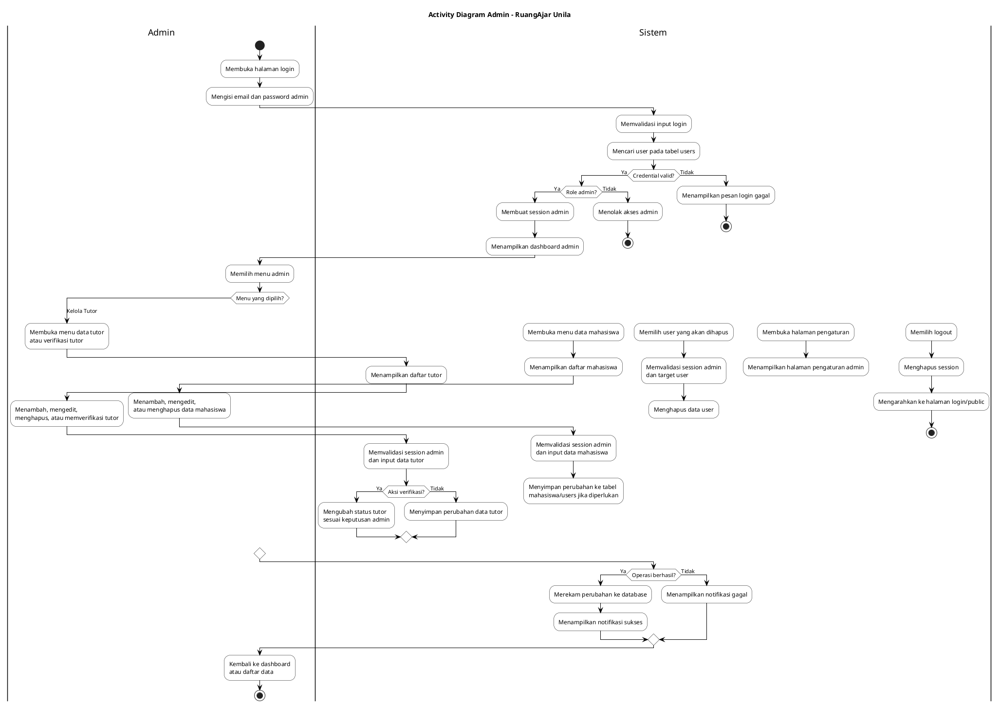

```plantuml
@startuml
title Activity Diagram Admin - RuangAjar Unila

skinparam monochrome true
skinparam shadowing false
skinparam activity {
  BackgroundColor white
  BorderColor black
  FontColor black
  ArrowColor black
}
skinparam swimlane {
  BorderColor black
}

|Admin|
start
:Membuka halaman login;
:Mengisi email dan password admin;

|Sistem|
:Memvalidasi input login;
:Mencari user pada tabel users;
if (Credential valid?) then (Ya)
  if (Role admin?) then (Ya)
    :Membuat session admin;
    :Menampilkan dashboard admin;
  else (Tidak)
    :Menolak akses admin;
    stop
  endif
else (Tidak)
  :Menampilkan pesan login gagal;
  stop
endif

|Admin|
:Memilih menu admin;

switch (Menu yang dipilih?)
case (Kelola Tutor)
  :Membuka menu data tutor\natau verifikasi tutor;
  |Sistem|
  :Menampilkan daftar tutor;
  |Admin|
  :Menambah, mengedit,\nmenghapus, atau memverifikasi tutor;
  |Sistem|
  :Memvalidasi session admin\ndan input data tutor;
  if (Aksi verifikasi?) then (Ya)
    :Mengubah status tutor\nsesuai keputusan admin;
  else (Tidak)
    :Menyimpan perubahan data tutor;
  endif
case (Kelola Mahasiswa)
  :Membuka menu data mahasiswa;
  |Sistem|
  :Menampilkan daftar mahasiswa;
  |Admin|
  :Menambah, mengedit,\natau menghapus data mahasiswa;
  |Sistem|
  :Memvalidasi session admin\ndan input data mahasiswa;
  :Menyimpan perubahan ke tabel\nmahasiswa/users jika diperlukan;
case (Hapus User)
  :Memilih user yang akan dihapus;
  |Sistem|
  :Memvalidasi session admin\ndan target user;
  :Menghapus data user;
case (Pengaturan)
  :Membuka halaman pengaturan;
  |Sistem|
  :Menampilkan halaman pengaturan admin;
case (Logout)
  :Memilih logout;
  |Sistem|
  :Menghapus session;
  :Mengarahkan ke halaman login/public;
  stop
endswitch

|Sistem|
if (Operasi berhasil?) then (Ya)
  :Merekam perubahan ke database;
  :Menampilkan notifikasi sukses;
else (Tidak)
  :Menampilkan notifikasi gagal;
endif

|Admin|
:Kembali ke dashboard\natau daftar data;
stop
@enduml
```
