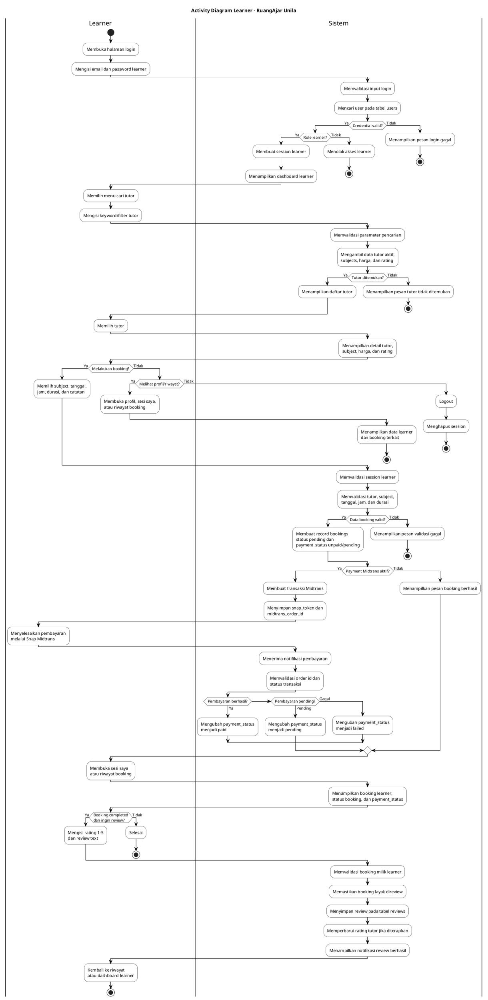

```plantuml
@startuml
title Activity Diagram Learner - RuangAjar Unila

skinparam monochrome true
skinparam shadowing false
skinparam activity {
  BackgroundColor white
  BorderColor black
  FontColor black
  ArrowColor black
}
skinparam swimlane {
  BorderColor black
}

|Learner|
start
:Membuka halaman login;
:Mengisi email dan password learner;

|Sistem|
:Memvalidasi input login;
:Mencari user pada tabel users;
if (Credential valid?) then (Ya)
  if (Role learner?) then (Ya)
    :Membuat session learner;
    :Menampilkan dashboard learner;
  else (Tidak)
    :Menolak akses learner;
    stop
  endif
else (Tidak)
  :Menampilkan pesan login gagal;
  stop
endif

|Learner|
:Memilih menu cari tutor;
:Mengisi keyword/filter tutor;

|Sistem|
:Memvalidasi parameter pencarian;
:Mengambil data tutor aktif,\nsubjects, harga, dan rating;
if (Tutor ditemukan?) then (Ya)
  :Menampilkan daftar tutor;
else (Tidak)
  :Menampilkan pesan tutor tidak ditemukan;
  stop
endif

|Learner|
:Memilih tutor;

|Sistem|
:Menampilkan detail tutor,\nsubject, harga, dan rating;

|Learner|
if (Melakukan booking?) then (Ya)
  :Memilih subject, tanggal,\njam, durasi, dan catatan;
else (Tidak)
  if (Melihat profil/riwayat?) then (Ya)
    :Membuka profil, sesi saya,\natau riwayat booking;
    |Sistem|
    :Menampilkan data learner\ndan booking terkait;
    stop
  else (Tidak)
    :Logout;
    |Sistem|
    :Menghapus session;
    stop
  endif
endif

|Sistem|
:Memvalidasi session learner;
:Memvalidasi tutor, subject,\ntanggal, jam, dan durasi;
if (Data booking valid?) then (Ya)
  :Membuat record bookings\nstatus pending dan\npayment_status unpaid/pending;
else (Tidak)
  :Menampilkan pesan validasi gagal;
  stop
endif

if (Payment Midtrans aktif?) then (Ya)
  :Membuat transaksi Midtrans;
  :Menyimpan snap_token dan\nmidtrans_order_id;
  |Learner|
  :Menyelesaikan pembayaran\nmelalui Snap Midtrans;
  |Sistem|
  :Menerima notifikasi pembayaran;
  :Memvalidasi order id dan\nstatus transaksi;
  if (Pembayaran berhasil?) then (Ya)
    :Mengubah payment_status\nmenjadi paid;
  elseif (Pembayaran pending?) then (Pending)
    :Mengubah payment_status\nmenjadi pending;
  else (Gagal)
    :Mengubah payment_status\nmenjadi failed;
  endif
else (Tidak)
  :Menampilkan pesan booking berhasil;
endif

|Learner|
:Membuka sesi saya\natau riwayat booking;

|Sistem|
:Menampilkan booking learner,\nstatus booking, dan payment_status;

|Learner|
if (Booking completed\ndan ingin review?) then (Ya)
  :Mengisi rating 1-5\ndan review text;
else (Tidak)
  :Selesai;
  stop
endif

|Sistem|
:Memvalidasi booking milik learner;
:Memastikan booking layak direview;
:Menyimpan review pada tabel reviews;
:Memperbarui rating tutor jika diterapkan;
:Menampilkan notifikasi review berhasil;

|Learner|
:Kembali ke riwayat\natau dashboard learner;
stop
@enduml
```
