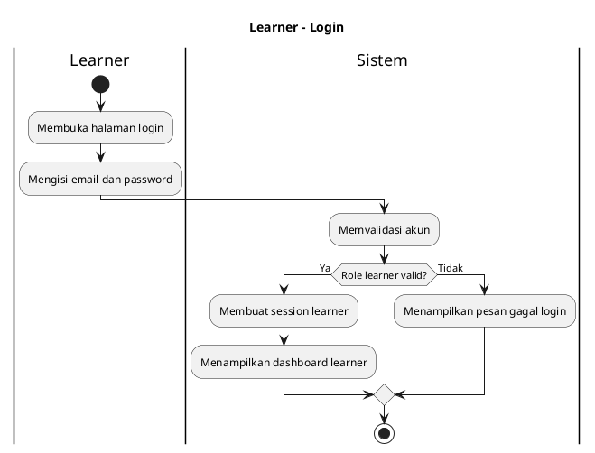
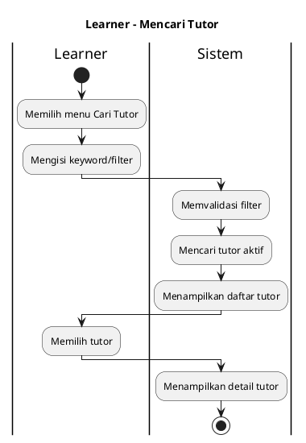
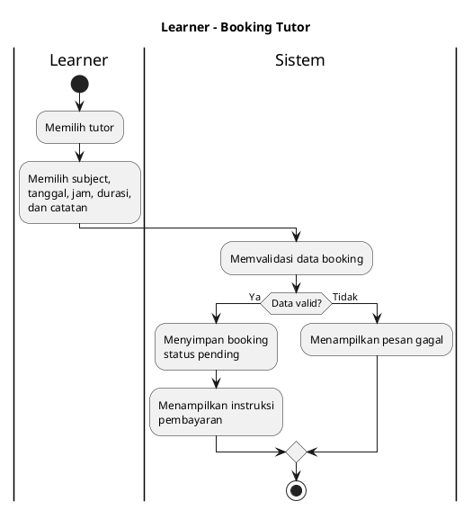
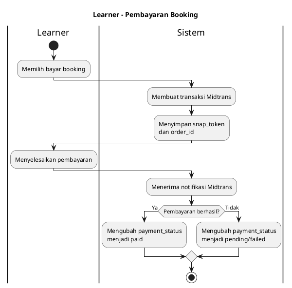
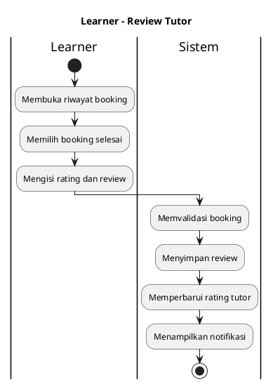

# Activity Diagram Learner

## Fitur Login Learner

```plantuml
@startuml
title Learner - Login

skinparam monochrome true
skinparam shadowing false
skinparam defaultFontName Arial

|Learner|
start
:Membuka halaman login;
:Mengisi email dan password;

|Sistem|
:Memvalidasi akun;
if (Role learner valid?) then (Ya)
  :Membuat session learner;
  :Menampilkan dashboard learner;
else (Tidak)
  :Menampilkan pesan gagal login;
endif

stop
@enduml
```

## Fitur Mencari Tutor

```plantuml
@startuml
title Learner - Mencari Tutor

skinparam monochrome true
skinparam shadowing false
skinparam defaultFontName Arial

|Learner|
start
:Memilih menu Cari Tutor;
:Mengisi keyword/filter;

|Sistem|
:Memvalidasi filter;
:Mencari tutor aktif;
:Menampilkan daftar tutor;

|Learner|
:Memilih tutor;

|Sistem|
:Menampilkan detail tutor;
stop
@enduml
```

## Fitur Booking Tutor

```plantuml
@startuml
title Learner - Booking Tutor

skinparam monochrome true
skinparam shadowing false
skinparam defaultFontName Arial

|Learner|
start
:Memilih tutor;
:Memilih subject,\ntanggal, jam, durasi,\ndan catatan;

|Sistem|
:Memvalidasi data booking;
if (Data valid?) then (Ya)
  :Menyimpan booking\nstatus pending;
  :Menampilkan instruksi\npembayaran;
else (Tidak)
  :Menampilkan pesan gagal;
endif

stop
@enduml
```

## Fitur Pembayaran

```plantuml
@startuml
title Learner - Pembayaran Booking

skinparam monochrome true
skinparam shadowing false
skinparam defaultFontName Arial

|Learner|
start
:Memilih bayar booking;

|Sistem|
:Membuat transaksi Midtrans;
:Menyimpan snap_token\ndan order_id;

|Learner|
:Menyelesaikan pembayaran;

|Sistem|
:Menerima notifikasi Midtrans;
if (Pembayaran berhasil?) then (Ya)
  :Mengubah payment_status\nmenjadi paid;
else (Tidak)
  :Mengubah payment_status\nmenjadi pending/failed;
endif

stop
@enduml
```

## Fitur Review Tutor

```plantuml
@startuml
title Learner - Review Tutor

skinparam monochrome true
skinparam shadowing false
skinparam defaultFontName Arial

|Learner|
start
:Membuka riwayat booking;
:Memilih booking selesai;
:Mengisi rating dan review;

|Sistem|
:Memvalidasi booking;
:Menyimpan review;
:Memperbarui rating tutor;
:Menampilkan notifikasi;

stop
@enduml
```
