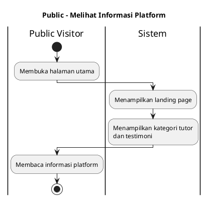
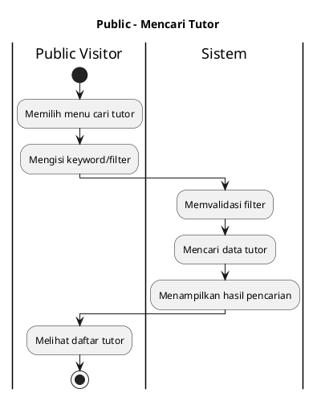
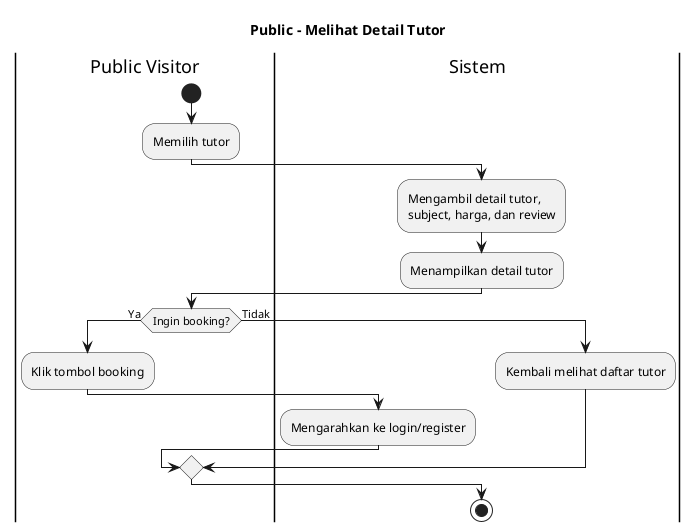

# Activity Diagram Public Visitor

## Fitur Melihat Informasi Platform

```plantuml
@startuml
title Public - Melihat Informasi Platform

skinparam monochrome true
skinparam shadowing false
skinparam defaultFontName Arial

|Public Visitor|
start
:Membuka halaman utama;

|Sistem|
:Menampilkan landing page;
:Menampilkan kategori tutor\ndan testimoni;

|Public Visitor|
:Membaca informasi platform;
stop
@enduml
```

## Fitur Mencari Tutor

```plantuml
@startuml
title Public - Mencari Tutor

skinparam monochrome true
skinparam shadowing false
skinparam defaultFontName Arial

|Public Visitor|
start
:Memilih menu cari tutor;
:Mengisi keyword/filter;

|Sistem|
:Memvalidasi filter;
:Mencari data tutor;
:Menampilkan hasil pencarian;

|Public Visitor|
:Melihat daftar tutor;
stop
@enduml
```

## Fitur Melihat Detail Tutor

```plantuml
@startuml
title Public - Melihat Detail Tutor

skinparam monochrome true
skinparam shadowing false
skinparam defaultFontName Arial

|Public Visitor|
start
:Memilih tutor;

|Sistem|
:Mengambil detail tutor,\nsubject, harga, dan review;
:Menampilkan detail tutor;

|Public Visitor|
if (Ingin booking?) then (Ya)
  :Klik tombol booking;
  |Sistem|
  :Mengarahkan ke login/register;
else (Tidak)
  :Kembali melihat daftar tutor;
endif

stop
@enduml
```
