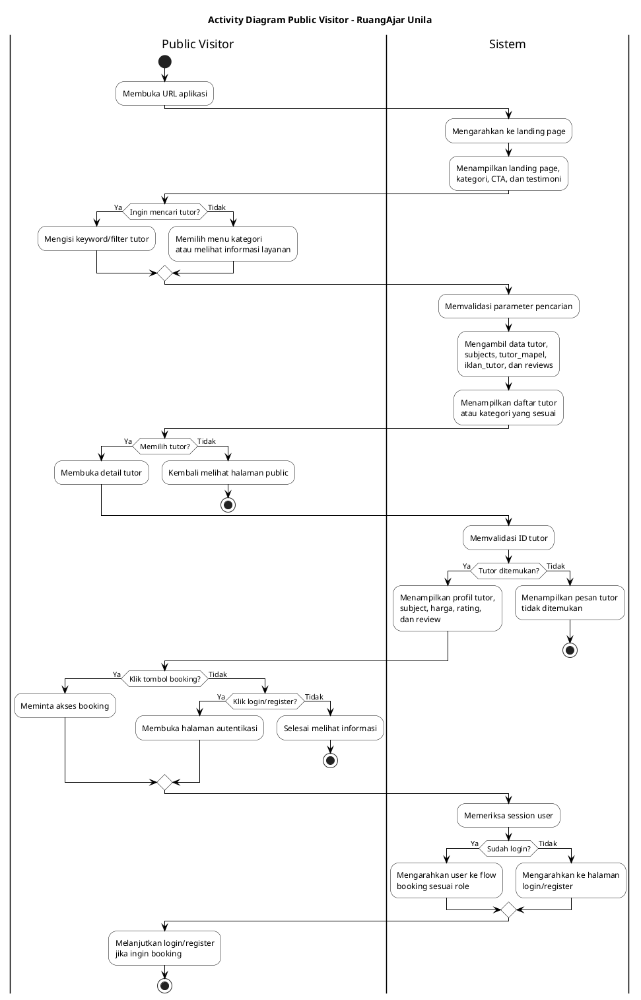

```plantuml
@startuml
title Activity Diagram Public Visitor - RuangAjar Unila

skinparam monochrome true
skinparam shadowing false
skinparam activity {
  BackgroundColor white
  BorderColor black
  FontColor black
  ArrowColor black
}
skinparam swimlane {
  BorderColor black
}

|Public Visitor|
start
:Membuka URL aplikasi;

|Sistem|
:Mengarahkan ke landing page;
:Menampilkan landing page,\nkategori, CTA, dan testimoni;

|Public Visitor|
if (Ingin mencari tutor?) then (Ya)
  :Mengisi keyword/filter tutor;
else (Tidak)
  :Memilih menu kategori\natau melihat informasi layanan;
endif

|Sistem|
:Memvalidasi parameter pencarian;
:Mengambil data tutor,\nsubjects, tutor_mapel,\niklan_tutor, dan reviews;
:Menampilkan daftar tutor\natau kategori yang sesuai;

|Public Visitor|
if (Memilih tutor?) then (Ya)
  :Membuka detail tutor;
else (Tidak)
  :Kembali melihat halaman public;
  stop
endif

|Sistem|
:Memvalidasi ID tutor;
if (Tutor ditemukan?) then (Ya)
  :Menampilkan profil tutor,\nsubject, harga, rating,\ndan review;
else (Tidak)
  :Menampilkan pesan tutor\ntidak ditemukan;
  stop
endif

|Public Visitor|
if (Klik tombol booking?) then (Ya)
  :Meminta akses booking;
else (Tidak)
  if (Klik login/register?) then (Ya)
    :Membuka halaman autentikasi;
  else (Tidak)
    :Selesai melihat informasi;
    stop
  endif
endif

|Sistem|
:Memeriksa session user;
if (Sudah login?) then (Ya)
  :Mengarahkan user ke flow\nbooking sesuai role;
else (Tidak)
  :Mengarahkan ke halaman\nlogin/register;
endif

|Public Visitor|
:Melanjutkan login/register\njika ingin booking;
stop
@enduml
```
