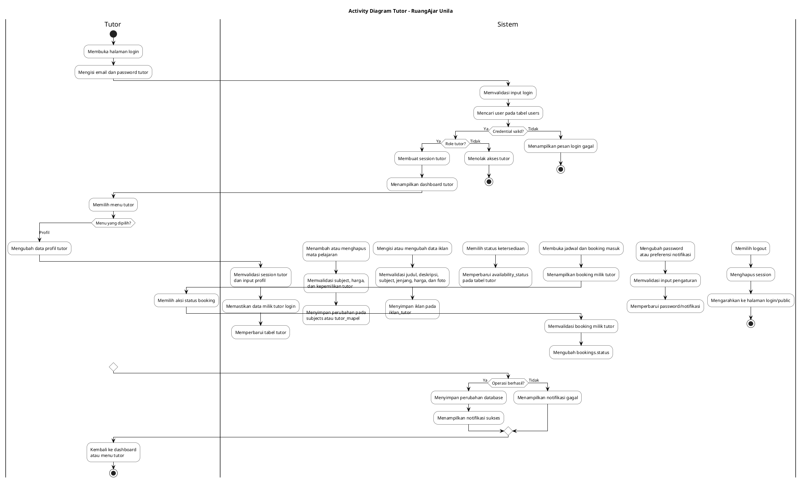

```plantuml
@startuml
title Activity Diagram Tutor - RuangAjar Unila

skinparam monochrome true
skinparam shadowing false
skinparam activity {
  BackgroundColor white
  BorderColor black
  FontColor black
  ArrowColor black
}
skinparam swimlane {
  BorderColor black
}

|Tutor|
start
:Membuka halaman login;
:Mengisi email dan password tutor;

|Sistem|
:Memvalidasi input login;
:Mencari user pada tabel users;
if (Credential valid?) then (Ya)
  if (Role tutor?) then (Ya)
    :Membuat session tutor;
    :Menampilkan dashboard tutor;
  else (Tidak)
    :Menolak akses tutor;
    stop
  endif
else (Tidak)
  :Menampilkan pesan login gagal;
  stop
endif

|Tutor|
:Memilih menu tutor;

switch (Menu yang dipilih?)
case (Profil)
  :Mengubah data profil tutor;
  |Sistem|
  :Memvalidasi session tutor\ndan input profil;
  :Memastikan data milik tutor login;
  :Memperbarui tabel tutor;
case (Mata Pelajaran)
  :Menambah atau menghapus\nmata pelajaran;
  |Sistem|
  :Memvalidasi subject, harga,\ndan kepemilikan tutor;
  :Menyimpan perubahan pada\nsubjects atau tutor_mapel;
case (Iklan Tutor)
  :Mengisi atau mengubah data iklan;
  |Sistem|
  :Memvalidasi judul, deskripsi,\nsubject, jenjang, harga, dan foto;
  :Menyimpan iklan pada\niklan_tutor;
case (Ketersediaan)
  :Memilih status ketersediaan;
  |Sistem|
  :Memperbarui availability_status\npada tabel tutor;
case (Booking/Jadwal)
  :Membuka jadwal dan booking masuk;
  |Sistem|
  :Menampilkan booking milik tutor;
  |Tutor|
  :Memilih aksi status booking;
  |Sistem|
  :Memvalidasi booking milik tutor;
  :Mengubah bookings.status;
case (Pengaturan Akun)
  :Mengubah password\natau preferensi notifikasi;
  |Sistem|
  :Memvalidasi input pengaturan;
  :Memperbarui password/notifikasi;
case (Logout)
  :Memilih logout;
  |Sistem|
  :Menghapus session;
  :Mengarahkan ke halaman login/public;
  stop
endswitch

|Sistem|
if (Operasi berhasil?) then (Ya)
  :Menyimpan perubahan database;
  :Menampilkan notifikasi sukses;
else (Tidak)
  :Menampilkan notifikasi gagal;
endif

|Tutor|
:Kembali ke dashboard\natau menu tutor;
stop
@enduml
```
