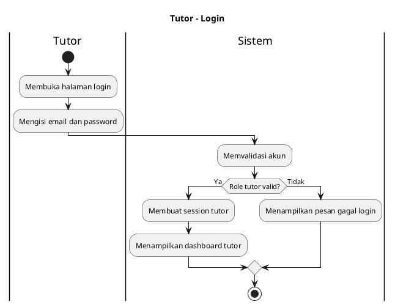
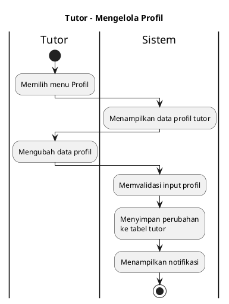
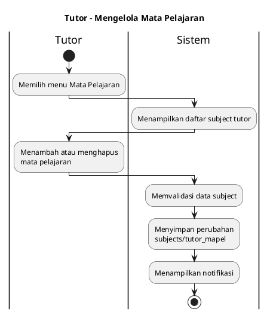
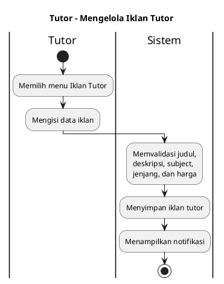
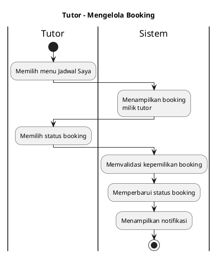

# Activity Diagram Tutor

## Fitur Login Tutor

```plantuml
@startuml
title Tutor - Login

skinparam monochrome true
skinparam shadowing false
skinparam defaultFontName Arial

|Tutor|
start
:Membuka halaman login;
:Mengisi email dan password;

|Sistem|
:Memvalidasi akun;
if (Role tutor valid?) then (Ya)
  :Membuat session tutor;
  :Menampilkan dashboard tutor;
else (Tidak)
  :Menampilkan pesan gagal login;
endif

stop
@enduml
```

## Fitur Mengelola Profil

```plantuml
@startuml
title Tutor - Mengelola Profil

skinparam monochrome true
skinparam shadowing false
skinparam defaultFontName Arial

|Tutor|
start
:Memilih menu Profil;

|Sistem|
:Menampilkan data profil tutor;

|Tutor|
:Mengubah data profil;

|Sistem|
:Memvalidasi input profil;
:Menyimpan perubahan\nke tabel tutor;
:Menampilkan notifikasi;

stop
@enduml
```

## Fitur Mengelola Mata Pelajaran

```plantuml
@startuml
title Tutor - Mengelola Mata Pelajaran

skinparam monochrome true
skinparam shadowing false
skinparam defaultFontName Arial

|Tutor|
start
:Memilih menu Mata Pelajaran;

|Sistem|
:Menampilkan daftar subject tutor;

|Tutor|
:Menambah atau menghapus\nmata pelajaran;

|Sistem|
:Memvalidasi data subject;
:Menyimpan perubahan\nsubjects/tutor_mapel;
:Menampilkan notifikasi;

stop
@enduml
```

## Fitur Mengelola Iklan Tutor

```plantuml
@startuml
title Tutor - Mengelola Iklan Tutor

skinparam monochrome true
skinparam shadowing false
skinparam defaultFontName Arial

|Tutor|
start
:Memilih menu Iklan Tutor;
:Mengisi data iklan;

|Sistem|
:Memvalidasi judul,\ndeskripsi, subject,\njenjang, dan harga;
:Menyimpan iklan tutor;
:Menampilkan notifikasi;

stop
@enduml
```

## Fitur Mengelola Booking

```plantuml
@startuml
title Tutor - Mengelola Booking

skinparam monochrome true
skinparam shadowing false
skinparam defaultFontName Arial

|Tutor|
start
:Memilih menu Jadwal Saya;

|Sistem|
:Menampilkan booking\nmilik tutor;

|Tutor|
:Memilih status booking;

|Sistem|
:Memvalidasi kepemilikan booking;
:Memperbarui status booking;
:Menampilkan notifikasi;

stop
@enduml
```
