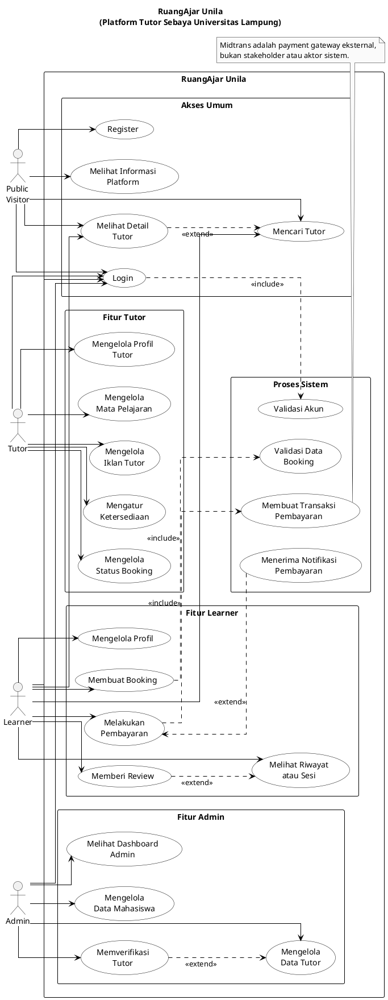

# Keterangan Use Case

## Public Visitor
- **Register**: Public visitor membuat akun baru agar dapat masuk sebagai learner atau tutor sesuai kebutuhan pendaftaran.
- **Login**: Public visitor masuk ke sistem menggunakan email dan password yang sudah terdaftar.
- **Melihat Informasi Platform**: Public visitor melihat landing page, informasi layanan, kategori tutor, dan testimoni.
- **Mencari Tutor**: Public visitor mencari tutor berdasarkan keyword atau filter yang tersedia.
- **Melihat Detail Tutor**: Public visitor membuka informasi detail tutor, seperti profil, mata pelajaran, harga, rating, dan review.

## Learner
- **Login**: Learner masuk ke sistem untuk mengakses fitur privat seperti booking, riwayat, dan review.
- **Mencari Tutor**: Learner mencari tutor yang sesuai dengan kebutuhan belajar.
- **Melihat Detail Tutor**: Learner memeriksa detail tutor sebelum melakukan booking.
- **Mengelola Profil**: Learner memperbarui data profil mahasiswa yang digunakan di dalam sistem.
- **Membuat Booking**: Learner memilih tutor, subject, tanggal, jam, durasi, dan catatan untuk membuat pemesanan sesi.
- **Melakukan Pembayaran**: Learner melakukan pembayaran booking melalui proses transaksi yang terhubung dengan payment gateway.
- **Melihat Riwayat atau Sesi**: Learner melihat daftar booking, status sesi, dan status pembayaran.
- **Memberi Review**: Learner memberikan rating dan ulasan setelah sesi selesai.

## Tutor
- **Login**: Tutor masuk ke sistem untuk mengelola layanan tutor dan booking.
- **Mengelola Profil Tutor**: Tutor memperbarui data profil, deskripsi, harga, keahlian, dan informasi akademik.
- **Mengelola Mata Pelajaran**: Tutor menambah, mengubah, atau menghapus mata pelajaran/subject yang diajarkan.
- **Mengelola Iklan Tutor**: Tutor membuat atau mengubah iklan jasa tutor yang ditampilkan ke calon learner.
- **Mengatur Ketersediaan**: Tutor mengatur status ketersediaan seperti tersedia, sibuk, atau tidak tersedia.
- **Mengelola Status Booking**: Tutor melihat booking masuk dan memperbarui status booking sesuai progres sesi.

## Admin
- **Login**: Admin masuk ke sistem untuk mengakses dashboard dan fitur pengelolaan data.
- **Melihat Dashboard Admin**: Admin melihat ringkasan data sistem seperti tutor, mahasiswa, user, dan aktivitas booking.
- **Mengelola Data Tutor**: Admin menambah, mengubah, menghapus, atau memeriksa data tutor.
- **Mengelola Data Mahasiswa**: Admin menambah, mengubah, menghapus, atau memeriksa data mahasiswa/learner.
- **Memverifikasi Tutor**: Admin memvalidasi data tutor dan mengubah status tutor agar dapat digunakan pada sistem.

## Proses Sistem
- **Validasi Akun**: Sistem memvalidasi email, password, dan role saat user melakukan login.
- **Validasi Data Booking**: Sistem memeriksa learner, tutor, subject, tanggal, jam, durasi, dan kelayakan data sebelum booking disimpan.
- **Membuat Transaksi Pembayaran**: Sistem membuat transaksi pembayaran dan menyimpan data transaksi seperti token/order ID.
- **Menerima Notifikasi Pembayaran**: Sistem menerima notifikasi dari payment gateway dan memperbarui status pembayaran booking.

## Relasi Include dan Extend
- **Login** `<<include>>` **Validasi Akun**: Setiap proses login wajib menjalankan validasi akun.
- **Melihat Detail Tutor** `<<extend>>` **Mencari Tutor**: Detail tutor biasanya dibuka setelah user menemukan tutor dari hasil pencarian.
- **Membuat Booking** `<<include>>` **Validasi Data Booking**: Booking wajib divalidasi sebelum disimpan.
- **Melakukan Pembayaran** `<<include>>` **Membuat Transaksi Pembayaran**: Pembayaran membutuhkan transaksi yang dibuat oleh sistem.
- **Menerima Notifikasi Pembayaran** `<<extend>>` **Melakukan Pembayaran**: Notifikasi pembayaran terjadi setelah proses pembayaran berjalan.
- **Memberi Review** `<<extend>>` **Melihat Riwayat atau Sesi**: Review diberikan dari riwayat/sesi yang sudah selesai.
- **Memverifikasi Tutor** `<<extend>>` **Mengelola Data Tutor**: Verifikasi tutor merupakan bagian lanjutan dari pengelolaan data tutor.
