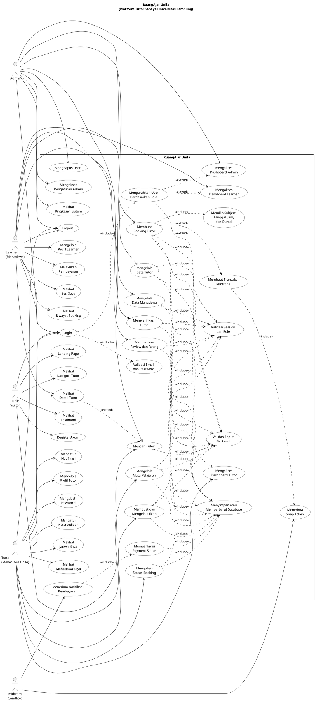

```plantuml
@startuml
title RuangAjar Unila\n(Platform Tutor Sebaya Universitas Lampung)

left to right direction
skinparam monochrome true
skinparam shadowing false
skinparam packageStyle rectangle
skinparam actorStyle stick
skinparam usecase {
  BackgroundColor white
  BorderColor black
  FontColor black
}
skinparam rectangle {
  BackgroundColor white
  BorderColor black
  FontColor black
}

actor "Public\nVisitor" as Public
actor "Learner\n(Mahasiswa)" as Learner
actor "Tutor\n(Mahasiswa Unila)" as Tutor
actor "Admin" as Admin
actor "Midtrans\nSandbox" as Midtrans

rectangle "RuangAjar Unila" as System {
  usecase "Melihat\nLanding Page" as UC_Landing
  usecase "Melihat\nKategori Tutor" as UC_Category
  usecase "Mencari Tutor" as UC_Search
  usecase "Melihat\nDetail Tutor" as UC_Detail
  usecase "Melihat\nTestimoni" as UC_Testimoni

  usecase "Register Akun" as UC_Register
  usecase "Login" as UC_Login
  usecase "Logout" as UC_Logout
  usecase "Validasi Email\ndan Password" as UC_ValidateCredential
  usecase "Mengarahkan User\nBerdasarkan Role" as UC_RoleRouting

  usecase "Mengakses\nDashboard Learner" as UC_LearnerDashboard
  usecase "Mengelola\nProfil Learner" as UC_LearnerProfile
  usecase "Membuat\nBooking Tutor" as UC_Booking
  usecase "Memilih Subject,\nTanggal, Jam,\ndan Durasi" as UC_SelectSchedule
  usecase "Melakukan\nPembayaran" as UC_Payment
  usecase "Melihat\nSesi Saya" as UC_MySession
  usecase "Melihat\nRiwayat Booking" as UC_History
  usecase "Memberikan\nReview dan Rating" as UC_Review

  usecase "Mengakses\nDashboard Tutor" as UC_TutorDashboard
  usecase "Mengelola\nProfil Tutor" as UC_TutorProfile
  usecase "Mengubah\nPassword" as UC_ChangePassword
  usecase "Mengatur\nKetersediaan" as UC_Availability
  usecase "Mengelola\nMata Pelajaran" as UC_Subject
  usecase "Membuat dan\nMengelola Iklan" as UC_Ads
  usecase "Melihat\nJadwal Saya" as UC_Schedule
  usecase "Melihat\nMahasiswa Saya" as UC_Students
  usecase "Mengubah\nStatus Booking" as UC_UpdateBooking
  usecase "Mengatur\nNotifikasi" as UC_Notification

  usecase "Mengakses\nDashboard Admin" as UC_AdminDashboard
  usecase "Melihat\nRingkasan Sistem" as UC_Summary
  usecase "Mengelola\nData Tutor" as UC_ManageTutor
  usecase "Mengelola\nData Mahasiswa" as UC_ManageStudent
  usecase "Memverifikasi\nTutor" as UC_VerifyTutor
  usecase "Menghapus User" as UC_DeleteUser
  usecase "Mengakses\nPengaturan Admin" as UC_AdminSetting

  usecase "Membuat Transaksi\nMidtrans" as UC_CreateTransaction
  usecase "Menerima\nSnap Token" as UC_SnapToken
  usecase "Menerima Notifikasi\nPembayaran" as UC_PaymentNotification
  usecase "Memperbarui\nPayment Status" as UC_UpdatePayment

  usecase "Validasi Session\ndan Role" as UC_ValidateSession
  usecase "Validasi Input\nBackend" as UC_ValidateInput
  usecase "Menyimpan atau\nMemperbarui Database" as UC_SaveData
}

Public --> UC_Landing
Public --> UC_Category
Public --> UC_Search
Public --> UC_Detail
Public --> UC_Testimoni
Public --> UC_Login
Public --> UC_Register

Learner --> UC_Login
Learner --> UC_Logout
Learner --> UC_LearnerDashboard
Learner --> UC_LearnerProfile
Learner --> UC_Search
Learner --> UC_Detail
Learner --> UC_Booking
Learner --> UC_Payment
Learner --> UC_MySession
Learner --> UC_History
Learner --> UC_Review

Tutor --> UC_Login
Tutor --> UC_Logout
Tutor --> UC_TutorDashboard
Tutor --> UC_TutorProfile
Tutor --> UC_ChangePassword
Tutor --> UC_Availability
Tutor --> UC_Subject
Tutor --> UC_Ads
Tutor --> UC_Schedule
Tutor --> UC_Students
Tutor --> UC_UpdateBooking
Tutor --> UC_Notification

Admin --> UC_Login
Admin --> UC_Logout
Admin --> UC_AdminDashboard
Admin --> UC_Summary
Admin --> UC_ManageTutor
Admin --> UC_ManageStudent
Admin --> UC_VerifyTutor
Admin --> UC_DeleteUser
Admin --> UC_AdminSetting

Midtrans --> UC_SnapToken
Midtrans --> UC_PaymentNotification

UC_Login ..> UC_ValidateCredential : <<include>>
UC_Login ..> UC_RoleRouting : <<include>>
UC_RoleRouting ..> UC_LearnerDashboard : <<extend>>
UC_RoleRouting ..> UC_TutorDashboard : <<extend>>
UC_RoleRouting ..> UC_AdminDashboard : <<extend>>

UC_Booking ..> UC_SelectSchedule : <<include>>
UC_Booking ..> UC_ValidateSession : <<include>>
UC_Booking ..> UC_ValidateInput : <<include>>
UC_Booking ..> UC_SaveData : <<include>>
UC_Booking ..> UC_CreateTransaction : <<extend>>

UC_CreateTransaction ..> UC_SnapToken : <<include>>
UC_PaymentNotification ..> UC_UpdatePayment : <<include>>
UC_UpdatePayment ..> UC_SaveData : <<include>>

UC_Review ..> UC_ValidateSession : <<include>>
UC_Review ..> UC_ValidateInput : <<include>>
UC_Review ..> UC_SaveData : <<include>>

UC_Subject ..> UC_ValidateSession : <<include>>
UC_Subject ..> UC_ValidateInput : <<include>>
UC_Subject ..> UC_SaveData : <<include>>

UC_Ads ..> UC_ValidateSession : <<include>>
UC_Ads ..> UC_ValidateInput : <<include>>
UC_Ads ..> UC_SaveData : <<include>>

UC_UpdateBooking ..> UC_ValidateSession : <<include>>
UC_UpdateBooking ..> UC_SaveData : <<include>>

UC_ManageTutor ..> UC_ValidateSession : <<include>>
UC_ManageTutor ..> UC_ValidateInput : <<include>>
UC_ManageTutor ..> UC_SaveData : <<include>>

UC_ManageStudent ..> UC_ValidateSession : <<include>>
UC_ManageStudent ..> UC_ValidateInput : <<include>>
UC_ManageStudent ..> UC_SaveData : <<include>>

UC_VerifyTutor ..> UC_ValidateSession : <<include>>
UC_VerifyTutor ..> UC_SaveData : <<include>>

UC_Search ..> UC_ValidateInput : <<include>>
UC_Detail ..> UC_Search : <<extend>>

@enduml
```
